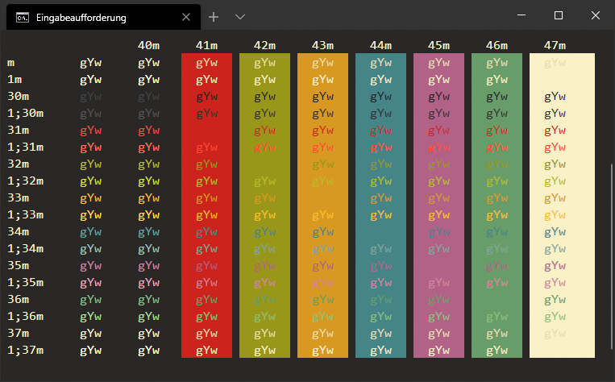

# Gruvbox

> An adoption of the Gruvbox theme as an iTerm theme.



iTerm color schemes are wildly accepted, like in MacOS Terminal, iTerm2, PuTTY, and even in the Windows Terminal (aka CMD).
To apply it to the Windows Terminal use [ColorTool](https://github.com/microsoft/terminal/tree/master/src/tools/ColorTool).
Not supported at the moment: Badge Color, Cursor Guide Color, Link Color.

For the new Windows Terminal `settings.json` copy the following into your settings (use it with `"colorScheme" : "Gruvbox"` in "defaults" or inside a profile):
```json
"schemes": [
	{
		"name": "Gruvbox",
		"cursorColor": "#fe8019",
		"foreground": "#ebdbb2",
		"background": "#2a2827",
		"black": "#1d2021",
		"red": "#cc241d",
		"green": "#98971a",
		"yellow": "#d79921",
		"blue": "#458588",
		"cyan": "#689d6a",
		"purple": "#b16286",
		"white": "#fbf1c7",
		"brightWhite": "#fbf1c7",
		"brightBlack": "#32302f",
		"brightRed": "#fb4934",
		"brightGreen": "#b8bb26",
		"brightYellow": "#fabd2f",
		"brightBlue": "#83a598",
		"brightPurple": "#d3869b",
		"brightCyan": "#8ec07c"
	}
],
```

For tons of other color schemes I recommend [this repo](https://github.com/mbadolato/iTerm2-Color-Schemes).

---

If you've ever wondered, what these secret codes of the `ColorTool.exe` (and similar tools) are: Those are the [ANSI escape sequences](https://bluesock.org/~willkg/dev/ansi.html).  
The first column to the left has the text colors, e.g. `32` means green. The rows with the `1;` appended mean "bold" – this clearly comes from times where you have benn in need of a color differentiation to display something like "bold" (_highlighted_) text. The first row shows the escape sequences for the background, where the number is offsetted by 10, thus `42` means a green background.